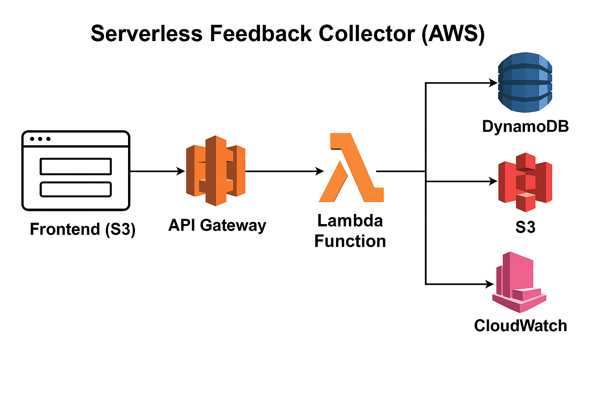
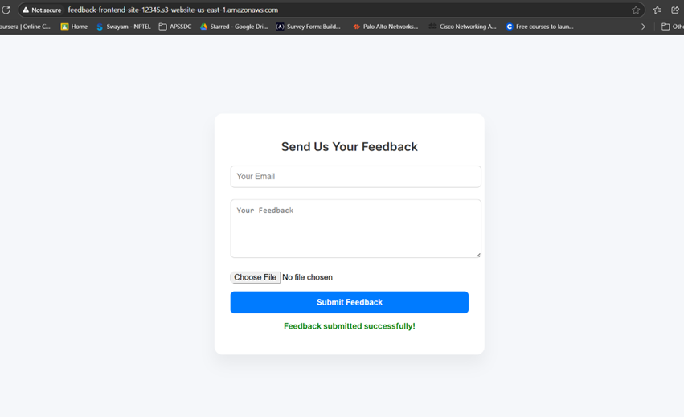
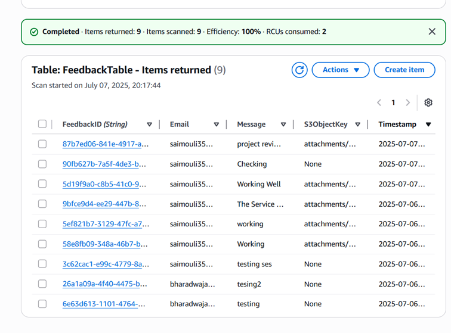
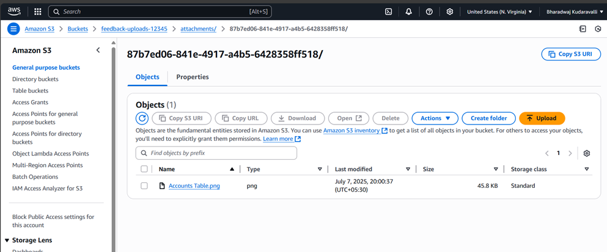
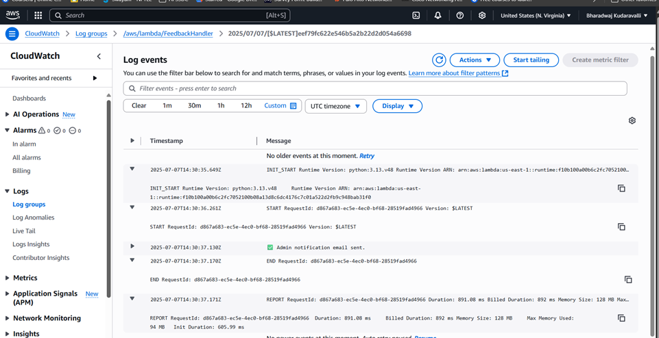

# Serverless Feedback Collector (AWS)

This project is a serverless feedback collection system built using AWS services such as Lambda, API Gateway, DynamoDB, S3, and SES. It allows users to submit feedback (text and files) via a simple frontend, and stores it securely in the cloud.

---

## 🛠️ Tech Stack

- **Frontend:** HTML, CSS, JavaScript (hosted on S3)
- **Backend:** AWS Lambda, API Gateway, DynamoDB, S3, CloudWatch
- **Optional:** Amazon SES (for email notifications)

---

## 🚀 Architecture Workflow

1. Frontend hosted on **S3** allows users to submit feedback through a form.
2. **API Gateway** receives the HTTP POST request and triggers a **Lambda function**.
3. The **Lambda function**:
   - Parses and validates the input.
   - Stores feedback text in **DynamoDB**.
   - Uploads files (if any) to **S3**.
   - Sends a confirmation email via **SES** *(optional)*.
4. All events are logged in **CloudWatch Logs** for observability.

5. 

---

## ✨ Features

- Fully serverless and scalable
- Accepts both text and file-based feedback
- Secure feedback storage in DynamoDB and S3
- Optional SES integration for notifications
- Logging and monitoring with CloudWatch
- IAM-based security and resource access control

---

## 📁 Suggested Repository Structure

serverless-feedback-collector/
├── frontend/
│   ├── index.html
│   ├── style.css
│   └── script.js
├── backend/
│   └── lambda/
│       └── submitFeedback.js
├── infrastructure/
│   └── cloudformation.yaml (or Terraform if used)
├── architecture-diagram.png
└── README.md

---
## 📸 Screenshots
- 
- 
- 
- 

---

## 🧠 Lessons Learned

- Hands-on deployment of a serverless app using AWS
- Connecting AWS services like Lambda, S3, DynamoDB, SES
- Writing secure, efficient Lambda code
- Configuring IAM roles and permissions
- Debugging with CloudWatch Logs

---

